# ITIGeeks - Competitive Programming & LMS Platform

## 1. Project Overview

**Name:** ITIGeeks

**Mission:** To gamify problem-solving for ITI students, foster a competitive coding culture, and provide supervisors with real-time analytics on student performance.

**Tech Stack:**
*   **Frontend:** React (Vite), Tailwind CSS
*   **Backend:** Firebase (Authentication, Firestore, Cloud Functions)
*   **Editor:** Monaco Editor (VS Code core)
*   **AI:** Gemini AI (for code review and coaching)
*   **Integrations:** LeetCode Proxy API

## 2. System Architecture

This high-level architecture demonstrates how the frontend interacts with Firebase services and external APIs.

```mermaid
graph TD
    User[User (Student/Supervisor)] -->|HTTPS| Client[Frontend (React App)]
    
    subgraph "Client Side"
        Client -->|Auth| FB_Auth[Firebase Auth]
        Client -->|Read/Write| FB_DB[Firestore Database]
        Client -->|Code Editor| Monaco[Monaco Editor]
    end
    
    subgraph "Backend Services"
        FB_Auth
        FB_DB
    end
    
    subgraph "External Integrations"
        Client -->|Fetch Problems| LC_API[LeetCode Proxy API]
        Client -->|Get Hints/Review| Gemini[Gemini AI API]
    end
    
    FB_DB -.->|Sync| LC_API
```

## 3. Database Schema Design

The following Entity-Relationship Diagram (ERD) outlines the core data models in Firestore.

```mermaid
erDiagram
    USERS ||--o{ SUBMISSIONS : makes
    USERS ||--o{ ASSIGNMENTS : completes
    USERS }|--|| GROUPS : belongs_to
    
    GROUPS ||--o{ TRACKS : part_of
    
    USERS {
        string uid PK
        string email
        string role "student|supervisor|admin"
        string groupId FK
        int totalSolved
        map problems "Status of local problems"
    }
    
    CONTESTS ||--o{ SUBMISSIONS : contains
    CONTESTS {
        string id PK
        string title
        timestamp startTime
        timestamp endTime
        string createdBy FK
        array problems
    }
    
    SUBMISSIONS {
        string id PK
        string userId FK
        string contestId FK
        string problemSlug
        string code
        string status "Accepted|Wrong Answer"
        timestamp createdAt
    }
    
    ASSIGNMENTS {
        string id PK
        string title
        timestamp deadline
        string groupId FK
        array problems
    }
```



## 4. Module Breakdown

### 🔐 Core Module
*   **Authentication:** Secure login via Firebase Auth (Google/Email).
*   **RBAC:** Role-Based Access Control enforcing permissions for Students, Supervisors, and Admins via `firestore.rules`.
*   **Profile Management:** User settings, LeetCode username syncing, and avatar management.

### 📚 Training Module
*   **Problem List:** A virtualized, searchable list of LeetCode problems with status tracking (Todo, Solving, Done).
*   **Filtering:** Filter problems by difficulty, status, or tags.
*   **Smart Sync:** Automatically fetches solved problems from LeetCode and updates the local "Done" status.

### 🤖 AI Module
*   **Smart Hints:** Context-aware hints generated by Gemini AI without revealing the full solution.
*   **Code Review:** "Big O" analysis and code quality feedback on demand.
*   **AI Coach:** A chat interface for guiding students through algorithmic concepts.

### 🏆 Competition Module
*   **Contest Arena:** Real-time coding environment with a countdown timer.
*   **Leaderboards:** Live ranking of students based on solved problems and time penalties.
*   **Verification:** Logic to validate solutions against test cases (mock or API-based).

### 📊 Analytics Module
*   **Supervisor Dashboard:** High-level overview of group performance.
*   **Radar Charts:** Visual comparison of student skills vs. group averages.
*   **Student Insights:** Detailed drill-down into individual student progress and weak areas.

## 5. User Journey Map: Verify Solution

This sequence diagram illustrates the flow when a student verifies a solution in the Contest Arena.

```mermaid
sequenceDiagram
    actor Student
    participant UI as React UI
    participant Proxy as LeetCode Proxy
    participant DB as Firestore
    
    Student->>UI: Clicks "Verify Solution"
    UI->>UI: Capture Code & Timestamp
    UI->>Proxy: Send Code for Execution
    activate Proxy
    Proxy-->>UI: Return Result (Accepted/Rejected)
    deactivate Proxy
    
    alt is Accepted
        UI->>DB: Create Submission Record
        UI->>DB: Update User Score
        UI-->>Student: Show Success Confetti 🎉
    else is Wrong Answer
        UI-->>Student: Show Error Message
    end
```



## 6. Future Roadmap

*   **Browser Extension:** To automatically sync LeetCode submissions without manual clicks.
*   **P2P Interviews:** Real-time collaborative coding rooms with video chat.
*   **Mobile App:** A React Native version for on-the-go review and tracking.
